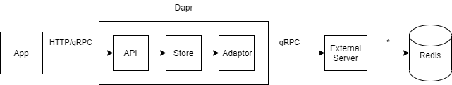

# External Dapr State Store
This is an experiment to see whether or not we can easily integrate an external Dapr state store over gRPC.
The code in this repo was hacked together in a couple of hours and is only meant to demonstrate a potential approach to supporting external
state stores in Dapr.

This repo relies on the following forks of Dapr:
* https://github.com/jjcollinge/components-contrib/tree/ext-state
* https://github.com/jjcollinge/dapr/tree/ext-state

# gRPC API
This repo contains code to run a gRPC API server for the Dapr state store components based on [this `proto` definition](https://github.com/jjcollinge/components-contrib/blob/ext-state/state/proto/v1/store.proto).
The Dapr fork also uses an [`external` state store provider](https://github.com/jjcollinge/components-contrib/tree/ext-state/state/external) which works as an adapator to invoke the external gRPC API.
The external gRPC API is written in Go so that it can leverage the existing state stores directly. However, the gRPC API could be written in any language and integrate with any custom state store that can satisfy the Dapr state store interface.

In it's current form, this service allows you to use any of the existing Dapr state stores and host them separately to the Dapr process.



# Usage
To run the external state store service. Run the command below:

```
go run main.go
```

> If you wish to override the port that the service listens on, set the `EXT_SS_PORT` environment variable or edit the `launch.json` file.

### Components

To use the `external` state store with the Dapr fork you must define a [Dapr state store component](https://docs.dapr.io/operations/components/setup-state-store/) as normal. We then extend the metadata document with an additional property `externalAddress`. This property informs Dapr where it can find the external service. This property will be stripped from the metadata and the rest of the metadata will be sent across to the external service as is.

```yaml
apiVersion: dapr.io/v1alpha1
kind: Component
metadata:
  name: statestore
  namespace: statestore
spec:
  type: state.external # Use the external state store type.
  version: v1
  metadata:
  - name: externalAddress # This is field is required and will be stripped.
    value: localhost:9191
  - name: redisHost # These properties stay the same as the concrete state store.
    value: localhost:6379
```
